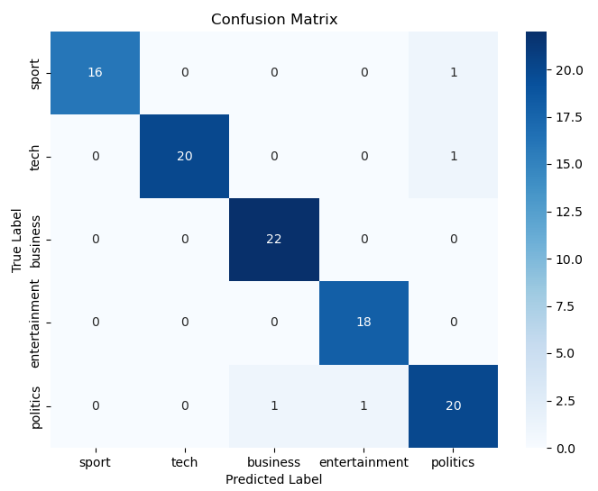

To reach the final result I created 2 separate Python files:
The first creates the model and saves it into JSON format.
The second file uses the model, with the NB method, calculates the accuracy 
and also displays a Confusion Matrix, to illustrate the results visually.

The JSON model is as follows:
Article cnt and every article type cnt:
```
  "article_count": 2125,
  "article_topic_count": {
    "sport": 494,
    "tech": 380,
    ...
  },
```
Amount of words for every topic:
```
 "topic_word_total": {
    "sport": 98039,
    "tech": 118690,
    ...
```
Word occurrence every topic:
```
"topic_word_counts": {
    "sport": {
      "henry": 58,
      "tipped": 9,
      ...
```
Unique word count:
```
"unique_words": 27308
```

The model is then loaded in the test_model.py
in `evaluate_accuracy()` the words from a single article are taken from bbc_test.csv
and the NB method is used to predict the topic based on the input article words and the "trained" model words. 

First we need the P(c) of the topic.
Then for every word of the input article the occurrences are taken from the current `topic_word_counts` and the word probability is calculated. 

This is done for all the topics.
The topic with the largest probabilty value is returned.

This is done with all the 100 articles in the test file and lastly accuraccy is calculated and a Confusion Matrix is displayed.

With the 'bbc_test.csv' the output using the bbc_train.csv is:
`Accuracy: 96.00%`



As can see the 4 wrong predictions are shown on the Confusion Matrix 

These results seem correct, I tested with an even smaller test file 'bbc_test_small.csv'
to ensure correctness and to get a further understanding.

bbc_test_small.csv contents:
```
1) sport,   "tablet vision machine"
2) tech,    "fifa sport rugby football"
3) business,"money stocks value"
4) business,"right wrong lie economy"
5) politics,"global climate war election"
```
The output is:
```
Real: sport     | Pred: tech     X
Real: tech      | Pred: sport    X
Real: business  | Pred: business 
Real: business  | Pred: politics X
Real: politics  | Pred: politics 
Accuracy: 40.00%
```

* In the 1) sport article the words are very related to tech
* In the 2) tech article the words are very related to sport
* In the 4) business article the words probably more used in most politics articles