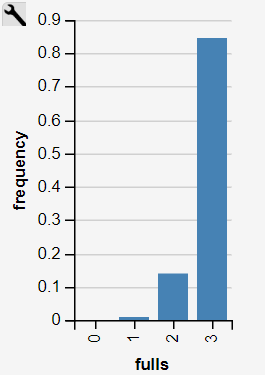
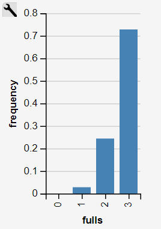

In the WebPPL this is the code that is used to solve the problems.
```
var batteries = ["batt1", "batt2", "batt3", "batt4"];

// Problem 1) friend gives opened pack
var batts = function() { 
  var emptybats = filter(function(elem) {flip(0.1)}, batteries);

  // Atleast 1 battery is empty.
  condition(emptybats.length >= 1);
  
  // Check how many of the 4 batteries are full.
  return {"fulls":4 - emptybats.length};
}
viz(Infer(batts));


// Problem 2) I open pack and first batt checked is empty.
var batts = function() {
  var batt1 = flip(0.1);
  var batt2 = flip(0.1);
  var batt3 = flip(0.1);
  var batt4 = flip(0.1);
  
  // First battery is empty
  condition(batt1 == false);
  
  // Remaining battery states, all trues are same as 1 in JS. 
  var remaining = batt2 + batt3 + batt4;
  return {"fulls":remaining};
}

viz(Infer(batts));
```

For the first problem the probability for the other batteries to be full was larger:




The probabilities for the second problem:
As can see it is more likely that more than 1 battery is half empty.



For me this makes a little sense. For the 2nd problem my intuition tells me that the probabilty of choosing the first battery and it also being empty, increases the likelihood of other batteries also being half-empty. 

Lets say there are 2 half-empty batteries. So the likelihood of me picking the first battery that is half-empty is also higher. Compared to an opened pack of batteries where the friend said that 1 of the batteries is empty.
