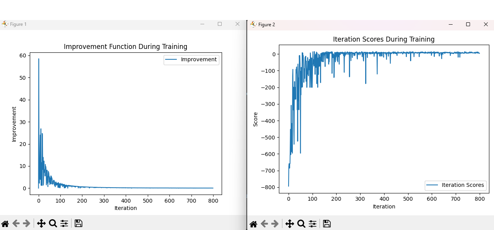
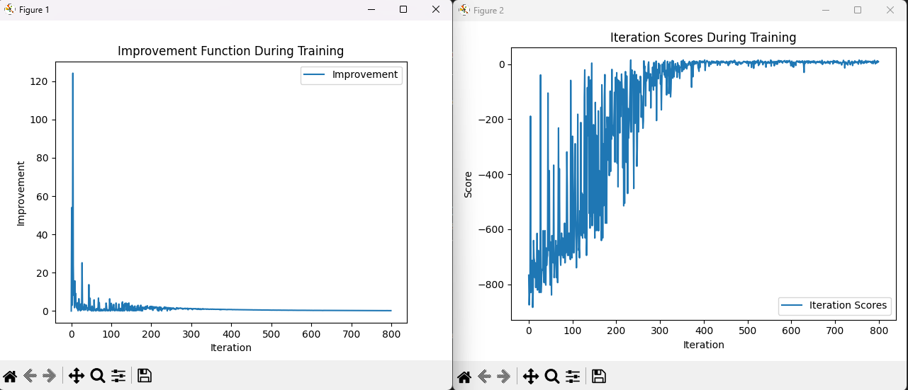

The Q-Learning model successfully completed the Taxi task 10 times in a row,
with atleast minimum 70 training iterations

The best results I got with:
```
alpha = 0.9 
gamma = 0.95
epsilon = 1 
```

I gradually decreased epsilon with a certain coefficent inside the training loop:
```
epsilon_step = epsilon/iterations
epsilon_coeff = 64

if epsilon > 0 :
    epsilon -= (epsilon_coeff * epsilon_step)
```

An epsilon coeff between 50-100 yielded the best results

```
    if truncated:
        success['cnt'] = 0
        break
    if terminated:
        if last_ep == ep_num - 1:
            success['cnt'] += 1
            success['last'] = ep_num
        last_ep = ep_num
        break
...
if temp_success['cnt'] == 10:
    success = deepcopy(temp_success)
```
When we end the course unsuccessfully, we reset the success count.
and when we got 10 in a row we save it into a new dict.

Sample output:
```
Iterations: 800
Average: -26.75
Last 10% average: (552 / 80) = 6.90
Total to learnt ratio: -3.88
10 Times in a row at iteration: 88
```
Graphs:



The total to learnt ratio metric is to compare the average score to last learned 10% avg. The close the result is to 0 the better the result. 


Results with:
```
alpha = 0.4         # Prev 0.9
gamma = 0.95
epsilon = 1 
epsilon_coeff = 2   # Prev 64
```

OUTPUT:
```
Iterations: 800
Average: -145.61
Last 10% average: (523 / 80) = 6.54
Total to learnt ratio: -22.27
10 Times in a row at iteration: 237
```



As can see the output greatly got worse, when the epsilon coeff and alpha decreased.

